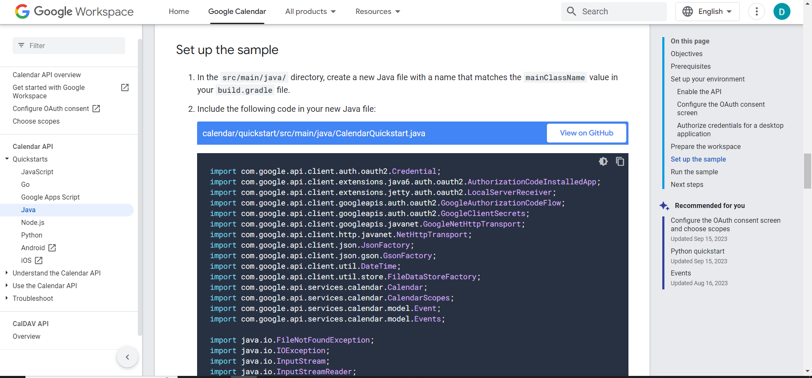
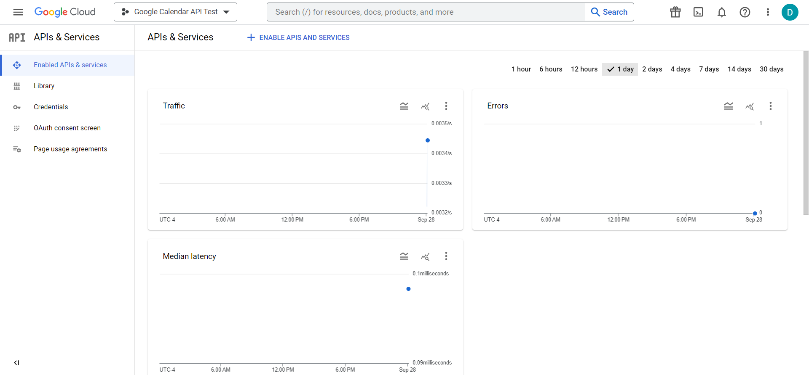
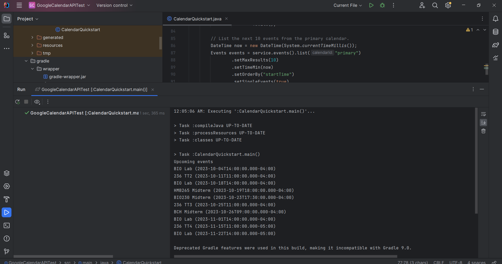

# Group 137 Term Project- MedBay
Our team will be creating a time management/inventory system for medications, hopefully utilizing APIs for cross-checking potential medication interactions, medication information database access, and Google Calendar integration. Users will log their medications and other pertinent information regarding scheduling/inventory. The program then checks for possible interactions between newly entered medications and stored medications (via API), raising a warning if there are potential conflicts. If no warning is raised, the program will generate automatic reminders/scheduled events on the user’s Google Calendar (via API) for taking the medication and restocking. The program also contains an in-program table containing all given information (with current dose inventory counters) with a link to the FDA page of each medication information (via API), as well as a checklist of all medications/restockings to take/do for the current day (where checking a task off will update the table and Google Calendar accordingly).

This is the link to the Google Calendar API documentation: https://developers.google.com/calendar/api/v3/reference

This is the link to the openFDA API documentation: https://open.fda.gov/apis/

This is the link to the HealthData Drug Interaction API documentation: https://lhncbc.nlm.nih.gov/RxNav/APIs/InteractionAPIs.html

=======
Using Google Workspace/Cloud to access/set up the Google Calendar API:

Example API output in Java (the next 10 calendar events):

>>>>>>> 1b2ff39e8eb23cc657217164364c05dcc8f60ba7
